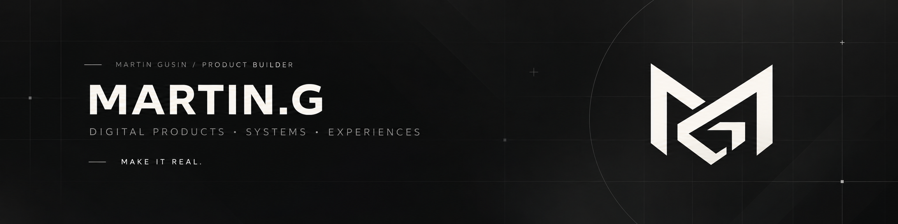

  

I build digital products, systems and experiences around real problems.

[**Explore MARTIN.G → martin-g.dev**](https://martin-g.dev)

## Selected work

**MARTIN.G**  
Personal portfolio and product showcase across digital products, systems and experiences.

**ON**  
A boutique dating-retreat brand and digital experience, from identity and visual direction to the live product.

**Deckify**  
A Spotify control experience focused on making setup, playback and everyday actions feel simple and intentional.

## What I build

Product experiences · Web applications · Internal systems · Automation · Brand-led digital experiences

## Stack

TypeScript · React · Next.js · Supabase · Vercel · Rust / Tauri · Python
